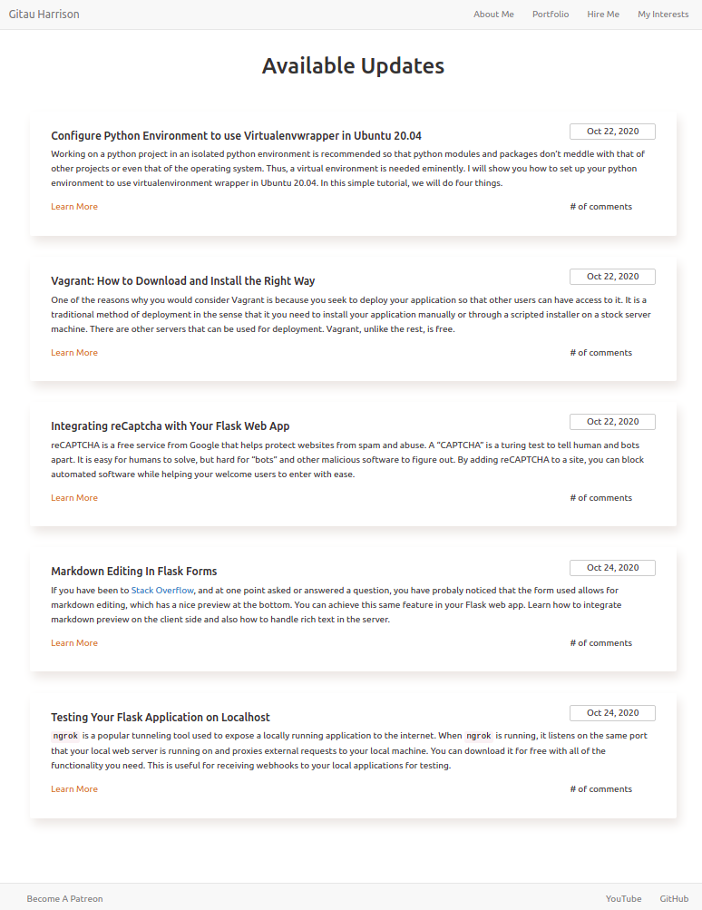

# I Am Found Here 100% of The Time

This will be my personal portfolio, where I will note all the projects I am involved in, my personal interests and other aspects of life I am engaged in.

Here is the  [full design](https://www.figma.com/proto/7crZ9XsIKbcptPwzuCxwDJ/Personal-Blog-Portfolio?node-id=1%3A2&scaling=min-zoom) of the blog. I used Figma to create the design for my reference as I **create** it from Scratch using Python and Flask.